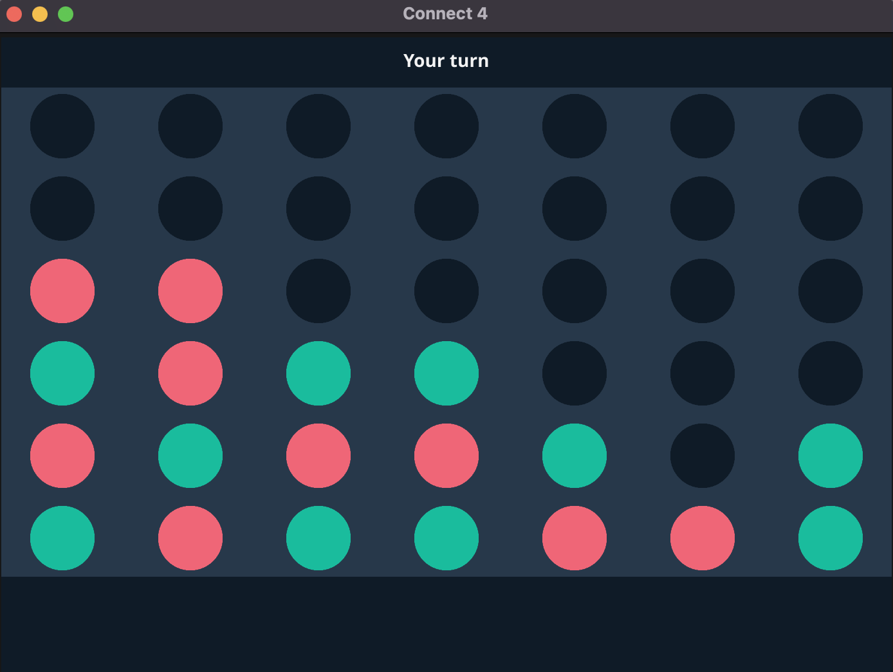

# connx4
a real-time multiplayer connect 4 game developed in go, with a gui client and a websocket-based server. server is containerized using docker and deployed on a kubernetes cluster

## features
- **real-time multiplayer gameplay:** play connect 4 against other players in real-time
- **cross-platform gui client:** built with the fyne library for a consistent experience on windows, macos, and linux
- **websocket communication:** fast and efficient real-time updates between the client and server
- **scalable server architecture:** server is containerized with docker and deployed on **azure kubernetes service (aks)**
- **automatic scaling:** utilizes **azure kubernetes**' horizontal pod autoscaling (hpa) to handle varying loads and ensure performance
- **global accessibility:** deployed on azure with a public ip for easy global access, allowing players from anywhere to join

## technologies used
- **go:** programming language for both server and client applications
- **fyne:** gui framework for building the client application
- **docker:** containerization tool for packaging the server application
- **azure kubernetes service (aks):** orchestration platform for deploying, scaling, and managing the server
- **websockets:** enables real-time communication between clients and the server

### Cloning the Repository
clone the repository to your local machine:

```git clone https://github.com/tejaspolu/connx4.git```

download go (for mac):

```brew install go```

navigate into project directory:

```cd connx4/client```

download dependencies:

```go mod tidy```

run the game:

```go run main.go game.go```

## player view:

